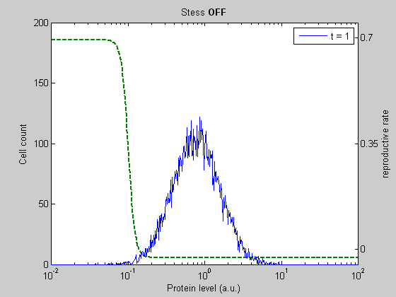
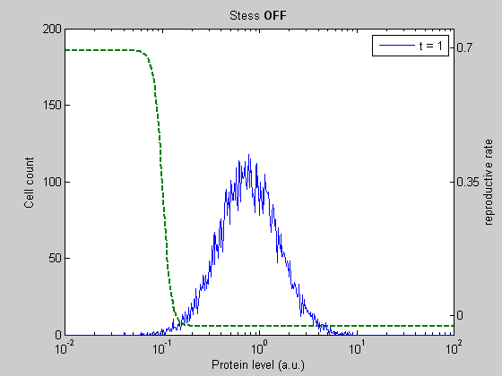

CellPopSim
==========

CellPopSim is a simulation framework. It is designed specifically for simulating the dynamics of cell populations at single-cell resolution. That is, it uses an individual-based or "agent-based" approach, rather than a modeling approach that lumps the individuals into variables that describe the collective and works only at that level.

I developed the framework as part of my Master's thesis with the goal of tackling certain types of biological questions involving heterogeneous populations of exponentially growing cells in culture, in particular, the interplay of gene expression dynamics (a major source of heterogeneity) and the resulting diversity in cellular fitness in the face of environmental perturbations and stress.

The main benefits this framework's method are:

- A way to define the behaviors of each agent in a flexible but encapsulated fashion, extending the idea of an event-firing "channel" from a well-known algorithm for simulating stochastic chemical reactions. These simulation channels are implemented as user-extended classes.
- A way to statically declare dependencies between simulation channels to minimize unnecessary event rescheduling steps.
- A way to approximate the distributional properties of a large population of individuals that undergo births and deaths using a finite, fixed-size collective of individuals.

When I began the project, I was still quite the CS neophyte and the initial prototyping was done in MATLAB, using its abysmal "object-oriented" features. This particular implementation, which I did for fun, was actually the way I learned (and learned to love) programming in Python! :)

As a first attempt at getting a working implementation, and looking back from more experience, there are more than enough design warts that are ripe for fixing. When I eventually get some free time (ha!), I'd like to fork this into a simple, but more generic and more performant agent-based simulation framework.

This work was done while I was a student in the [Dynamical Systems Biology Lab](www.sysbiolab.uottawa.ca).